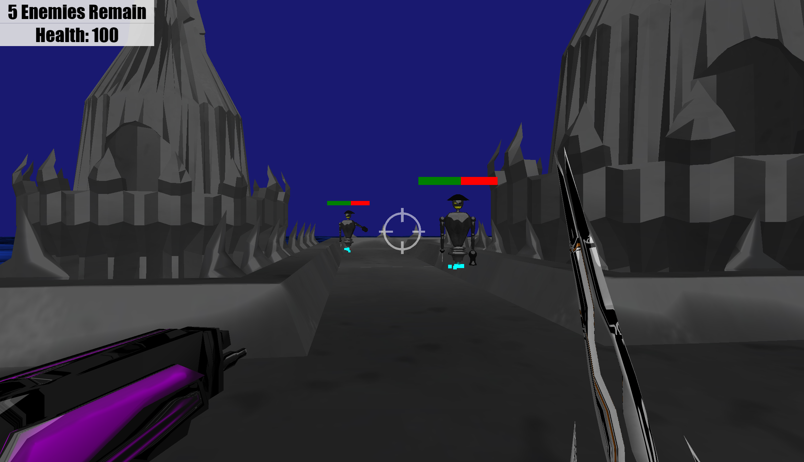
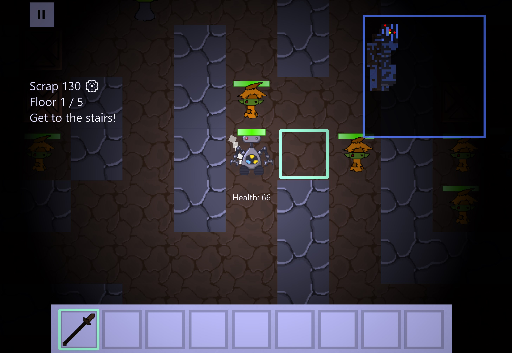

# Resume

Download a copy of my resume [here](resources/Resume_ConnieHilarides.pdf)

# Contact

- Email: [connie@connieh.com](mailto:connie@connieh.com)
- [GitHub](https://github.com/connicpu)
- [LinkedIn](https://www.linkedin.com/in/connicpu/)

# Projects

## Academic Projects

### HoloTowers

<iframe width="560" height="315" src="https://www.youtube.com/embed/rqgNteujCW8" frameborder="0" allow="accelerometer; autoplay; encrypted-media; gyroscope; picture-in-picture" allowfullscreen></iframe>

### Pirate Hunt

[Download the game here](resources/Pirate_Setup.exe)

### Roguebot

2D turn-based rogue-like dungeon crawler

This game was built as part of a multi-semester team project at DigiPen,
from Sep 2014 - April 2015.
The game was written primarily in C++, with Ruby scripting.
I lead the team's technical direction, and primarily built the game's
core engine, rendering, and scripting integration.

[Download the game here](resources/Roguebot_Setup.exe)

## Open Source work

### directx-rs

Rust bindings for various DirectX APIs, currently with a focus on Direct2D.

- [`direct2d` docs](https://docs.rs/direct2d/0.2.0/direct2d/)
- [`math2d` docs](https://docs.rs/math2d/0.1.3/math2d/)
- [Repository](https://github.com/connicpu/directx-rs)

### com-impl

A Rust library for generating implementations of COM interfaces.
Referenced in [this MSRC article](https://msrc-blog.microsoft.com/2019/10/08/designing-a-com-library-for-rust/).

- [Documentation](https://docs.rs/com-impl/0.1.1/com_impl/)
- [Repository](https://github.com/Connicpu/com-impl)

### Other contributions

#### [winapi](https://github.com/retep998/winapi-rs)

I've contributed a lot of Windows API bindings to the `winapi` Rust library,
including a [large chunk](https://github.com/retep998/winapi-rs/pull/164)
of the Direct2D, DirectWrite, and DXGI bindings.

